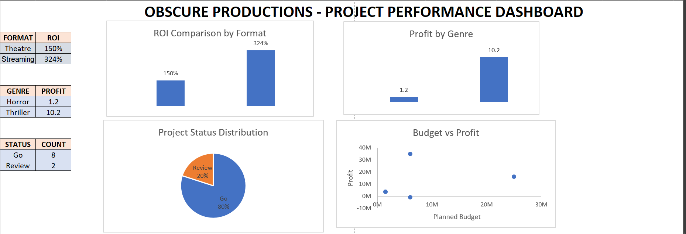

# Movie Production Portfolio Analysis
This Excel project analyzes the financial performance of a movie production portfolio using financial modeling and dashboard visualization.

## Project Overview
The model evaluates profitability, ROI, and project performance across multiple productions to support portfolio-level decision making.

## Project Structure
The workbook contains three main components:

1. **Model Assumptions**
   Financial and operational assumptions used across the model.

2. **Project Pipeline Model**
   Project-level dataset including budget, estimated revenue, profit, and ROI calculations.

3. **Executive Dashboard**
   Visual dashboard showing portfolio performance through charts and key metrics.

## Key Insights
* Streaming projects generate higher average ROI than theatre projects.
* Thriller genre contributes significantly more profit than horror.
* A small number of projects require review due to negative ROI.
* Higher budget projects introduce greater profit volatility.

## Tools Used
* Microsoft Excel
* Financial Modeling
* Data Analysis
* Dashboard Visualization

## Dashboard

